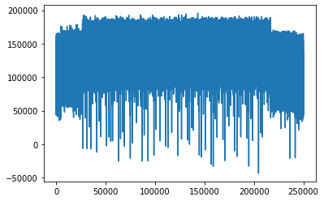
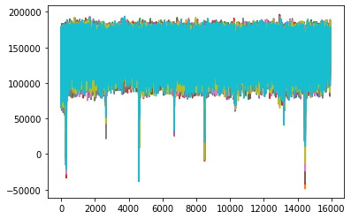

```python
# -*- coding: utf-8 -*-

"""

Side-Channel Analysis 101
2. differential power analysis on DES software implementation

DES is implemented on CW ufo xmega microcontroller

lasf modified 2022.04.26

----------------------------------------------------
Sunghyun Jin
sunghyunjin@korea.ac.kr
https://sunghyunjin.com

Cryptographic Algorithm Lab.

School of Cyber Security,
Korea University,
Republic of Korea

Center for Information Security Technologies (CIST),
Institute of Cyber Security & Privacy (ICSP),
Korea University,
Republic of Korea
----------------------------------------------------
"""
print('')
```

    


```python
import os

import h5py
import numpy as np
import tqdm

import matplotlib.pyplot as plt
%matplotlib inline

from bokeh.plotting import figure, show
from bokeh.io import output_notebook
from bokeh.resources import INLINE
from bokeh.models import Span
from bokeh.palettes import Spectral11

output_notebook(INLINE)
```


<div class="bk-root">
    <a href="https://bokeh.org" target="_blank" class="bk-logo bk-logo-small bk-logo-notebook"></a>
    <span id="1002">Loading BokehJS ...</span>
</div>


```python
def check_file_exists(file_path, verbose = True):
    if os.path.exists(file_path) == False:
        if verbose:
            print("Error: provided file path '%s' does not exist!" % file_path)
        return False
    if verbose:
        print("EXIST :", file_path)
    return True
```

## 1. Data Loading


```python
fpath = '../dataset'
fname = fpath + '/cw-xmega-des-jin-5MHz-50MS-10ppc-N5000-comp1ppc--2022.04.07-18.50.58.h5'

if check_file_exists(fname):
    with h5py.File(fname, 'r') as h5f:
        print(list(h5f.keys()))

        print('traces     :', h5f['traces'].shape)
        print('plaintext  :', h5f['plaintext'].shape)
        print('ciphertext :', h5f['ciphertext'].shape)
        print('key        :', h5f['key'].shape)

        tr1 = h5f['traces'][0, :] #.astype(np.double)
        tr = h5f['traces'][:, 26710:42650].astype(np.double) # 0.9 GB
        pt = h5f['plaintext'][:]
        pt = pt.astype(np.uint8)
        ct = h5f['ciphertext'][:]
        ct = ct.astype(np.uint8)
        key = h5f['key'][0]
        key = key.astype(np.uint8)
        
        print('load ... success')

        print('traces     :', tr.shape)
        print('plaintext  :', pt.shape)
        print('ciphertext :', ct.shape)
        print('key        :', key.shape)
```

    EXIST : ../dataset/cw-xmega-des-jin-5MHz-50MS-10ppc-N5000-comp1ppc--2022.04.07-18.50.58.h5
    ['ciphertext', 'key', 'plaintext', 'traces']
    traces     : (5000, 250000)
    plaintext  : (5000, 8)
    ciphertext : (5000, 8)
    key        : (5000, 8)
    load ... success
    traces     : (5000, 15940)
    plaintext  : (5000, 8)
    ciphertext : (5000, 8)
    key        : (8,)


```python
print('key :', ['%02X' % i for i in key])
```

    key : ['B6', '29', 'CD', '75', 'FB', 'D9', 'B3', '52']


## 2. Visual Inspection (SPA, Simple Power Analysis)


```python
plt.plot(tr1)
plt.show()
```


    

    


```python
deltaplot = figure(plot_width=800)

deltaplot.title.text = 'A total power consumption trace'
deltaplot.title.align = 'center'
deltaplot.title.text_font_size = '25px'

deltaplot.xaxis.axis_label = 'time'
deltaplot.yaxis.axis_label = 'power'

xrange = list(range(tr1.shape[0]))
deltaplot.line(xrange, tr1)
show(deltaplot)
```


<div class="bk-root" id="0f6dc435-be5d-4c29-81bb-e9b4f3fa4f3e" data-root-id="1003"></div>


```python
plt.plot(tr[0:10, :].T)
plt.show()
```


    

    


```python
num = 30

deltaplot = figure(plot_width=800)

deltaplot.title.text = '%d power consumption traces' % num
deltaplot.title.align = 'center'
deltaplot.title.text_font_size = '25px'

deltaplot.xaxis.axis_label = 'time'
deltaplot.yaxis.axis_label = 'power'

xrange = list(range(tr.shape[1]))
for i, t in enumerate(tr[:num]):
    deltaplot.line(xrange, t, color = Spectral11[i % len(Spectral11)])
show(deltaplot)
```


<div class="bk-root" id="e18d9c20-5930-4b24-a90e-4ba2892884ea" data-root-id="1109"></div>


```python
deltaplot = figure(plot_width=800)

deltaplot.title.text = 'mean trace'
deltaplot.title.align = 'center'
deltaplot.title.text_font_size = '25px'

deltaplot.xaxis.axis_label = 'time'
deltaplot.yaxis.axis_label = 'power'

xrange = list(range(tr.shape[1]))
deltaplot.line(xrange, np.mean(tr, axis=0))
show(deltaplot)
```


<div class="bk-root" id="b6f2227d-ea8e-44b7-9fb3-21c7f4d46dd2" data-root-id="1748"></div>


```python
deltaplot = figure(plot_width=800)

deltaplot.title.text = 'variance trace'
deltaplot.title.align = 'center'
deltaplot.title.text_font_size = '25px'

deltaplot.xaxis.axis_label = 'time'
deltaplot.yaxis.axis_label = 'power'

xrange = list(range(tr.shape[1]))
deltaplot.line(xrange, np.var(tr, axis=0))
show(deltaplot)
```


<div class="bk-root" id="2a2949c3-4fb5-4dca-9347-80698d3fe8c0" data-root-id="1934"></div>


# DPA targeting plaintext & ciphertext


```python
ith = 0
```


```python
tmp = np.vectorize((lambda x: (x >> 7) & 0x1))(pt[:,0])
ind1 = np.where(tmp == 0)[0]
ind2 = np.where(tmp != 0)[0]
print('#MSB(0/1) -> {} : {}'.format(ind1.shape[0], ind2.shape[0]))
```

    #MSB(0/1) -> 2475 : 2525


```python
dom = np.mean(tr[ind1,:], axis = 0) - np.mean(tr[ind2], axis = 0)
```


```python
deltaplot = figure(plot_width=800)

deltaplot.title.text = 'Difference of Mean'
deltaplot.title.align = 'center'
deltaplot.title.text_font_size = '25px'

deltaplot.xaxis.axis_label = 'time'
deltaplot.yaxis.axis_label = 'difference'

xrange = list(range(dom.shape[0]))
deltaplot.line(xrange, dom)
show(deltaplot)
```


<div class="bk-root" id="759ac828-f4c5-4db5-90fe-f06a50814824" data-root-id="2131"></div>


```python
def calculate_dom_pt(tr, pt, ith, bit):
    tmp = np.vectorize((lambda x: (x >> bit) & 0x1))(pt[:,ith])
    ind1 = np.where(tmp == 0)[0]
    ind2 = np.where(tmp != 0)[0]
    dom = np.mean(tr[ind1,:], axis = 0) - np.mean(tr[ind2], axis = 0)
    return dom
```


```python
dom_pt = np.zeros((8*8, tr.shape[1]), dtype = np.double)
ind = 0
for ith in tqdm.tqdm(range(8)):
    for bit in range(7, -1, -1):
        dom_pt[ind, :] = calculate_dom_pt(tr, pt, ith, bit)
        ind += 1
```

    100%|█████████████████████████████████████████████| 8/8 [00:05<00:00,  1.39it/s]


```python
#num = 8
num = dom_pt.shape[0]

deltaplot = figure(plot_width=800)

deltaplot.title.text = '%d Difference of Mean' % num
deltaplot.title.align = 'center'
deltaplot.title.text_font_size = '25px'

deltaplot.xaxis.axis_label = 'time'
deltaplot.yaxis.axis_label = 'diff'

xrange = list(range(dom_pt.shape[1]))
for i, t in enumerate(dom_pt[:num]):
    deltaplot.line(xrange, t, color = Spectral11[i % len(Spectral11)])
show(deltaplot)
```


<div class="bk-root" id="bce9fff8-1ee7-4132-85c0-4f37b7e86fa5" data-root-id="2339"></div>


```python
ith = 0

dom = np.zeros((tr.shape[1],))

for bs in range(0, 7):
    pttmp = np.vectorize((lambda x: (x >> bs) & 0x1))(pt[:,ith])
    ind1 = np.where(pttmp == 0)[0]
    ind2 = np.where(pttmp != 0)[0]
    dom += (np.mean(tr[ind1,:], axis = 0) - np.mean(tr[ind2], axis = 0))
```


```python
deltaplot = figure(plot_width=800)

deltaplot.title.text = 'Difference of Mean'
deltaplot.title.align = 'center'
deltaplot.title.text_font_size = '25px'

deltaplot.xaxis.axis_label = 'time'
deltaplot.yaxis.axis_label = 'difference'

xrange = list(range(dom.shape[0]))
deltaplot.line(xrange, dom)
show(deltaplot)
```


<div class="bk-root" id="ccf5779e-fb27-4399-bb63-b5c11c5fa2d4" data-root-id="3692"></div>


```python
deltaplot = figure(plot_width=800)

deltaplot.title.text = 'Trace & DoM Traces'
deltaplot.title.align = 'center'
deltaplot.title.text_font_size = '25px'

deltaplot.xaxis.axis_label = 'time'
deltaplot.yaxis.axis_label = 'power'

deltaplot.background_fill_color = '#2F2F2F'

xrange = list(range(tr.shape[1]))
deltaplot.line(xrange, np.mean(tr, axis = 0), color = 'yellow', line_width=1)

num = dom_pt.shape[0]
xrange = list(range(dom_pt.shape[1]))
for i, t in enumerate(dom_pt[:num]):
    deltaplot.line(xrange, t * 2 + 7.5e4, color = Spectral11[i % len(Spectral11)])
show(deltaplot)
```


<div class="bk-root" id="6abd559b-c431-45cc-868e-4fbdb5112298" data-root-id="4048"></div>


# DPA targeting sbox output

[wikipedia - DES](https://en.wikipedia.org/wiki/Data_Encryption_Standard)

[fips 46-3](https://csrc.nist.gov/csrc/media/publications/fips/46/3/archive/1999-10-25/documents/fips46-3.pdf)


```python
from des import DES
```


```python
def ks(key):
    des = DES()
    keybits = np.unpackbits(key.reshape((-1, 1)), axis = 1).reshape((64,))
    
    buf = np.zeros((56,), dtype=np.uint8)
    for i, j in enumerate(des.PC_1):
        buf[i] = keybits[j-1]

    C = buf[:28]
    D = buf[28:]
    
    ls = [
        1, 1, 2, 2, 2, 2, 2, 2,
        1, 2, 2, 2, 2, 2, 2, 1
    ]
    
    rk = np.zeros((16, 8), dtype=np.uint8)
    
    for r in range(16):
        for bs in range(ls[r]):
            tmp = C[0]
            C[0:-1] = C[1:]
            C[-1] = tmp
            tmp = D[0]
            D[0:-1] = D[1:]
            D[-1] = tmp
        
        keybits = np.concatenate([C, D])
        
        buf = np.zeros((48,), dtype=np.uint8)
        for i, j in enumerate(des.PC_2):
            buf[i] = keybits[j-1]
        rktmp = np.zeros((8, 8), dtype = np.uint8)
        rktmp[:,2:] = buf.reshape((8,6))
        rk[r,:] = np.packbits(rktmp, axis = 1).reshape((-1,8))
    
    return rk
```


```python
rk = ks(key)
for i, rki in enumerate(rk):
    print('%2d round key :' % (i+1), ''.join(['%02X ' % li for li in rki]))
```

     1 round key : 1F 21 3B 1F 3B 10 14 2A 
     2 round key : 0E 17 3E 31 01 3D 1E 30 
     3 round key : 35 13 37 3D 16 10 35 21 
     4 round key : 35 3E 1B 15 32 2C 20 1C 
     5 round key : 17 3D 3E 26 10 17 1E 1C 
     6 round key : 3E 2B 07 2F 2E 11 02 29 
     7 round key : 2E 1C 19 2F 30 25 28 27 
     8 round key : 38 15 2E 3E 05 22 2E 3C 
     9 round key : 1D 2F 1B 2A 21 06 10 17 
    10 round key : 3E 2D 35 16 3B 32 0B 04 
    11 round key : 1B 0E 2D 1F 2C 0C 0F 0B 
    12 round key : 09 3F 14 3F 05 29 18 07 
    13 round key : 3B 30 37 33 37 22 17 20 
    14 round key : 3F 3E 2A 39 0A 0E 2D 09 
    15 round key : 27 3B 1E 1A 1C 2F 10 12 
    16 round key : 2C 36 2F 0F 22 29 25 1F 


```python
def des_1r_f_sbox(pt, ith, gk):
    des = DES()
    
    ptb = np.unpackbits(pt)
    gkb = np.array([int(i) for i in bin(gk)[2:].zfill(6)])
    
    buf_ip = np.zeros((64,), dtype = np.uint8)
    for i, j in enumerate(des.PI):
        buf_ip[i] = ptb[j - 1]
    L = buf_ip[:32]
    R = buf_ip[32:]
    
    buf_exp = np.zeros((48,), dtype = np.uint8)
    for i, j in enumerate(des.E):
        buf_exp[i] = R[j - 1]
    buf_addkey = buf_exp[6 * ith : 6 * ith + 6] ^ gkb
    
    ix = (buf_addkey[0] << 1) | buf_addkey[-1]
    tmp = np.zeros((8,), dtype = np.uint8)
    tmp[4:] = buf_addkey[1:-1]
    iy = np.packbits(tmp)[0]
    
    return des.S[ith][ix][iy]
```


```python
def calculate_dom_1r_sbox(tr, pt, ith, bit):
    dom_ret = np.zeros((1<<6, tr.shape[1]), dtype = np.double)
    intv = np.zeros((pt.shape[0],), dtype = np.uint8)
    for i, gk in enumerate(tqdm.tqdm(range(1<<6))):
        for j in range(pt.shape[0]):
            intv[j] = (des_1r_f_sbox(pt[j], ith, gk) >> bit) & 0x1
        ind1 = np.where(intv == 0)[0]
        ind2 = np.where(intv != 0)[0]
        dom_ret[i,:] = np.mean(tr[ind1,:], axis = 0) - np.mean(tr[ind2,:], axis = 0)
    return dom_ret
```


```python
ith = 0
bit = 3
dom_1r_sbox = calculate_dom_1r_sbox(tr, pt, ith, bit)
```

    100%|███████████████████████████████████████████| 64/64 [00:13<00:00,  4.90it/s]


```python
deltaplot = figure(plot_width=800)

deltaplot.title.text = 'DPA 1 Round #%d Sbox MSB' % (ith + 1)
deltaplot.title.align = 'center'
deltaplot.title.text_font_size = '25px'

deltaplot.xaxis.axis_label = 'time'
deltaplot.yaxis.axis_label = 'difference'

xrange = list(range(dom_1r_sbox.shape[1]))
for i, t in enumerate(dom_1r_sbox):
    deltaplot.line(xrange, t, color = Spectral11[i % len(Spectral11)])
show(deltaplot)
```


<div class="bk-root" id="4f8e10d7-7408-4c4e-9308-82512b6f2855" data-root-id="5567"></div>


```python
deltaplot = figure(plot_width=800)

deltaplot.title.text = 'DPA 1 Round 1st Sbox MSB'
deltaplot.title.align = 'center'
deltaplot.title.text_font_size = '25px'

deltaplot.xaxis.axis_label = 'time'
deltaplot.yaxis.axis_label = 'difference'

deltaplot.line(list(range(64)), np.max(np.abs(dom_1r_sbox), axis = 1))
show(deltaplot)
```


<div class="bk-root" id="fadc5d52-2c5f-4971-a5c2-17f68c9dc130" data-root-id="7207"></div>


```python
def analysis_dpa(dpat, ith, key, verbose=False):
    
    rk = ks(key)
    
    dpata = np.abs(dpat)
    dpatam = dpata.max(axis=1)
    ind = np.argsort(dpata, axis=1)[:,-1]
    dpatam = dpata[np.arange(64),ind]
    gk = np.argsort(dpatam)

    if verbose:
        peak_1_pos = ind[gk[-1]]
        peak_2_pos = ind[gk[-2]]
        peak_3_pos = ind[gk[-3]]
        peak_1 = dpat[gk[-1], peak_1_pos]
        peak_2 = dpat[gk[-2], peak_2_pos]
        peak_3 = dpat[gk[-3], peak_3_pos]
        print('[%02d : rk %02X(%3d)]' % (ith+1, rk[0, ith], rk[0, ith]),
        #print('[Byte %02d]' % ith,
               '1st %02X(=%3d) %7f (@%6d),' % (gk[-1], gk[-1], peak_1, peak_1_pos),
               '2nd %02X(=%3d) %7f (@%6d),' % (gk[-2], gk[-2], peak_2, peak_2_pos),
               'condifdence: %f' % (np.abs(peak_1)/np.abs(peak_2)))
    
    return gk[::-1], dpata[gk[::-1], ind[gk[::-1]]], ind[gk[::-1]]
```


```python
dpat_k = np.zeros((8, tr.shape[1]), dtype = np.double)
for ith in range(8):
    dpat = calculate_dom_1r_sbox(tr, pt, ith, 3)
    dpa_result = analysis_dpa(dpat, ith, key, True)
    dpat_k[ith, :] = dpat[dpa_result[0][0],:]
```

    100%|███████████████████████████████████████████| 64/64 [00:11<00:00,  5.69it/s]


    [01 : rk 1F( 31)] 1st 1F(= 31) 10729.250290 (@ 13567), 2nd 1E(= 30) -5751.173350 (@ 13567), condifdence: 1.865576


    100%|███████████████████████████████████████████| 64/64 [00:11<00:00,  5.78it/s]


    [02 : rk 21( 33)] 1st 21(= 33) 5895.521565 (@ 13716), 2nd 1B(= 27) 4502.504296 (@ 14263), condifdence: 1.309387


    100%|███████████████████████████████████████████| 64/64 [00:11<00:00,  5.78it/s]


    [03 : rk 3B( 59)] 1st 3B(= 59) 9183.594231 (@ 14109), 2nd 39(= 57) -5958.599966 (@ 14109), condifdence: 1.541234


    100%|███████████████████████████████████████████| 64/64 [00:11<00:00,  5.78it/s]


    [04 : rk 1F( 31)] 1st 1F(= 31) 10297.859838 (@ 14183), 2nd 30(= 48) 7891.283601 (@ 13297), condifdence: 1.304966


    100%|███████████████████████████████████████████| 64/64 [00:11<00:00,  5.78it/s]


    [05 : rk 3B( 59)] 1st 3B(= 59) 8116.793653 (@ 13536), 2nd 1D(= 29) 4813.084211 (@ 13743), condifdence: 1.686402


    100%|███████████████████████████████████████████| 64/64 [00:11<00:00,  5.46it/s]


    [06 : rk 10( 16)] 1st 10(= 16) 7055.852081 (@ 13410), 2nd 34(= 52) 5527.643550 (@ 13410), condifdence: 1.276467


    100%|███████████████████████████████████████████| 64/64 [00:11<00:00,  5.67it/s]


    [07 : rk 14( 20)] 1st 14(= 20) 9919.389535 (@ 14389), 2nd 2F(= 47) -5364.452591 (@ 14389), condifdence: 1.849096


    100%|███████████████████████████████████████████| 64/64 [00:11<00:00,  5.76it/s]


    [08 : rk 2A( 42)] 1st 2A(= 42) 10090.596615 (@ 13447), 2nd 1D(= 29) -5666.644409 (@ 14422), condifdence: 1.780701


```python
deltaplot = figure(plot_width=800)

deltaplot.title.text = 'DPA 1 Round all Sbox MSB'
deltaplot.title.align = 'center'
deltaplot.title.text_font_size = '25px'

deltaplot.xaxis.axis_label = 'time'
deltaplot.yaxis.axis_label = 'difference'

xrange = list(range(dpat_k.shape[1]))
for i, t in enumerate(dpat_k):
    deltaplot.line(xrange, t, color = Spectral11[i % len(Spectral11)])
show(deltaplot)
```


<div class="bk-root" id="23af05e9-fbba-4222-907f-733a63d1b62f" data-root-id="7850"></div>


## DPA optimization version 1


```python
def des_1r_f_sbox_vector(pt, ith, gk):
    des = DES()
    
    ptb = np.unpackbits(pt, axis = 1)
    gkb = np.array([int(i) for i in bin(gk)[2:].zfill(6)])
    
    buf_ip = np.zeros(ptb.shape, dtype = np.uint8)
    for i, j in enumerate(des.PI):
        buf_ip[:,i] = ptb[:,j-1]
        
    L = buf_ip[:,:32]
    R = buf_ip[:,32:]
    
    buf_exp = np.zeros((pt.shape[0], 48), dtype = np.uint8)
    for i, j in enumerate(des.E):
        buf_exp[:,i] = R[:,j-1]
    buf_addkey = buf_exp[:, 6*ith : 6*ith + 6] ^ gkb
    
    ix = np.zeros((pt.shape[0], 8), dtype = np.uint8)
    ix[:,-2] = buf_addkey[:,0]
    ix[:,-1] = buf_addkey[:,5]
    ix = np.packbits(ix, axis = 1).reshape((pt.shape[0],))
    
    iy = np.zeros((pt.shape[0], 8), dtype = np.uint8)
    iy[:,-4:] = buf_addkey[:,1:5]
    iy = np.packbits(iy, axis = 1).reshape((pt.shape[0],))
    
    buf_sbox = np.zeros((pt.shape[0],), dtype = np.uint8)
    for n, ij in enumerate(zip(ix, iy)):
        buf_sbox[n] = des.S[ith][ij[0]][ij[1]]

    return np.unpackbits(buf_sbox.reshape((-1,1)), axis = 1)[:,4:]
```


```python
def calculate_dom_1r_sbox_vector(tr, pt, ith, bit):
    dom_ret = np.zeros((1<<6, tr.shape[1]), dtype = np.double)
    for i, gk in enumerate(tqdm.tqdm(range(1<<6))):
        intv = des_1r_f_sbox_vector(pt, ith, gk)[:, 3 - bit]
        ind1 = np.where(intv == 0)[0]
        ind2 = np.where(intv != 0)[0]
        dom_ret[i,:] = np.mean(tr[ind1,:], axis = 0) - np.mean(tr[ind2,:], axis = 0)
    return dom_ret
```


```python
ith = 0
bit = 3
dom_1r_sbox_vector = calculate_dom_1r_sbox(tr, pt, ith, bit)
_ = analysis_dpa(dom_1r_sbox_vector, ith, key, True)
```

    100%|███████████████████████████████████████████| 64/64 [00:11<00:00,  5.80it/s]


    [01 : rk 1F( 31)] 1st 1F(= 31) 10729.250290 (@ 13567), 2nd 1E(= 30) -5751.173350 (@ 13567), condifdence: 1.865576


## DPA optimization version 2


```python
def calculate_accfreq(tr, pt, ith):
    des = DES()
    
    ptb = np.unpackbits(pt, axis = 1)
    buf_ip = np.zeros(ptb.shape, dtype = np.uint8)
    for i, j in enumerate(des.PI):
        buf_ip[:,i] = ptb[:,j-1]
        
    R = buf_ip[:,32:]
    
    buf_exp = np.zeros((pt.shape[0], 48), dtype = np.uint8)
    for i, j in enumerate(des.E):
        buf_exp[:,i] = R[:,j-1]
    buf = np.zeros((pt.shape[0], 8), dtype = np.uint8)
    buf[:,2:] = buf_exp[:, 6*ith : 6*ith + 6]
    intv = np.packbits(buf, axis = 1).reshape((pt.shape[0],))
    
    tracc = np.zeros((1<<6, tr.shape[1]), dtype = np.double)
    freq = np.zeros((1<<6,), dtype = np.int32)
    indl = []
    for i in range(1<<6):
        ind = np.where(intv == i)[0]
        indl.append(ind[:])
        freq[i] = ind.shape[0]
        tracc[i] = np.sum(tr[ind,:], axis = 0)
    return tracc, freq, indl
```


```python
def des_1r_f_sbox_optim(pt, ith, gk):
    des = DES()
    v_addkey = pt ^ gk
    ix = ((v_addkey >> 4) & 0x2) | (v_addkey & 0x1)
    iy = (v_addkey >> 1) & 0xF
    return des.S[ith][ix][iy]
```


```python
def calculate_dom_1r_sbox_optim(tr, pt, ith, bit):
    tracc, freq, _ = calculate_accfreq(tr, pt, ith)
    
    dom_ret = np.zeros((1<<6, tr.shape[1]), dtype = np.double)
    intv = np.zeros((1<<6,), dtype = np.uint8)
    for i, gk in enumerate(tqdm.tqdm(range(1<<6))):
        for j in range(1<<6):
            intv[j] = (des_1r_f_sbox_optim(j, ith, gk) >> bit) & 0x1
        ind1 = np.where(intv == 0)[0]
        ind2 = np.where(intv != 0)[0]
        dom_ret[i,:] = (tracc[ind1,:].sum(axis = 0) / (freq[ind1].sum() * 1.0)
                        - tracc[ind2,:].sum(axis = 0) / (freq[ind2].sum() * 1.0))
    return dom_ret
```


```python
ith = 0
bit = 3
dom_1r_sbox_optim = calculate_dom_1r_sbox_optim(tr, pt, ith, bit)
_ = analysis_dpa(dom_1r_sbox_optim, ith, key, True)
```

    100%|█████████████████████████████████████████| 64/64 [00:00<00:00, 1155.74it/s]


    [01 : rk 1F( 31)] 1st 1F(= 31) 10729.250290 (@ 13567), 2nd 1E(= 30) -5751.173350 (@ 13567), condifdence: 1.865576


```python
for ith in range(8):
    dpat = calculate_dom_1r_sbox_optim(tr, pt, ith, 3)
    dpa_result = analysis_dpa(dpat, ith, key, True)
```

    100%|█████████████████████████████████████████| 64/64 [00:00<00:00, 1076.73it/s]


    [01 : rk 1F( 31)] 1st 1F(= 31) 10729.250290 (@ 13567), 2nd 1E(= 30) -5751.173350 (@ 13567), condifdence: 1.865576


    100%|█████████████████████████████████████████| 64/64 [00:00<00:00, 1182.04it/s]


    [02 : rk 21( 33)] 1st 21(= 33) 5895.521565 (@ 13716), 2nd 1B(= 27) 4502.504296 (@ 14263), condifdence: 1.309387


    100%|█████████████████████████████████████████| 64/64 [00:00<00:00, 1339.28it/s]


    [03 : rk 3B( 59)] 1st 3B(= 59) 9183.594231 (@ 14109), 2nd 39(= 57) -5958.599966 (@ 14109), condifdence: 1.541234


    100%|█████████████████████████████████████████| 64/64 [00:00<00:00, 1236.57it/s]


    [04 : rk 1F( 31)] 1st 1F(= 31) 10297.859838 (@ 14183), 2nd 30(= 48) 7891.283601 (@ 13297), condifdence: 1.304966


    100%|█████████████████████████████████████████| 64/64 [00:00<00:00, 1171.84it/s]


    [05 : rk 3B( 59)] 1st 3B(= 59) 8116.793653 (@ 13536), 2nd 1D(= 29) 4813.084211 (@ 13743), condifdence: 1.686402


    100%|█████████████████████████████████████████| 64/64 [00:00<00:00, 1269.23it/s]


    [06 : rk 10( 16)] 1st 10(= 16) 7055.852081 (@ 13410), 2nd 34(= 52) 5527.643550 (@ 13410), condifdence: 1.276467


    100%|█████████████████████████████████████████| 64/64 [00:00<00:00, 1208.46it/s]


    [07 : rk 14( 20)] 1st 14(= 20) 9919.389535 (@ 14389), 2nd 2F(= 47) -5364.452591 (@ 14389), condifdence: 1.849096


    100%|█████████████████████████████████████████| 64/64 [00:00<00:00, 1571.32it/s]


    [08 : rk 2A( 42)] 1st 2A(= 42) 10090.596615 (@ 13447), 2nd 1D(= 29) -5666.644409 (@ 14422), condifdence: 1.780701


## Performance comparison


```python
ith = 7
bit = 3

dom_1r_sbox = calculate_dom_1r_sbox(tr, pt, ith, bit)
print('Naive version')
_ = analysis_dpa(dom_1r_sbox, ith, key, True)

dom_1r_sbox_vector = calculate_dom_1r_sbox_vector(tr, pt, ith, bit)
print('Optimization version 1')
_ = analysis_dpa(dom_1r_sbox_vector, ith, key, True)

dom_1r_sbox_optim = calculate_dom_1r_sbox_optim(tr, pt, ith, bit)
print('Optimization version 2')
_ = analysis_dpa(dom_1r_sbox_optim, ith, key, True)
```

    100%|███████████████████████████████████████████| 64/64 [00:11<00:00,  5.76it/s]


    Naive version
    [08 : rk 2A( 42)] 1st 2A(= 42) 10090.596615 (@ 13447), 2nd 1D(= 29) -5666.644409 (@ 14422), condifdence: 1.780701


    100%|███████████████████████████████████████████| 64/64 [00:05<00:00, 10.78it/s]


    Optimization version 1
    [08 : rk 2A( 42)] 1st 2A(= 42) 10090.596615 (@ 13447), 2nd 1D(= 29) -5666.644409 (@ 14422), condifdence: 1.780701


    100%|█████████████████████████████████████████| 64/64 [00:00<00:00, 1094.44it/s]


    Optimization version 2
    [08 : rk 2A( 42)] 1st 2A(= 42) 10090.596615 (@ 13447), 2nd 1D(= 29) -5666.644409 (@ 14422), condifdence: 1.780701


```python

```
